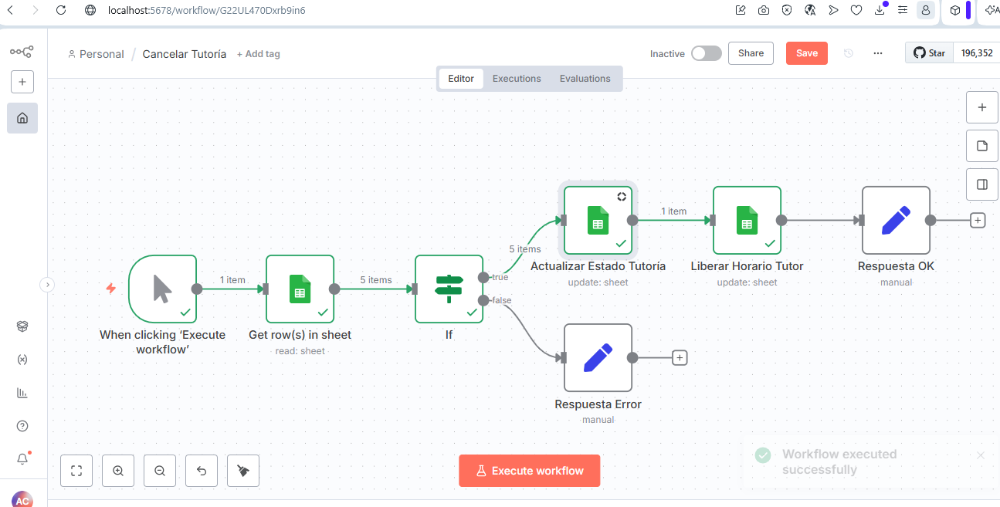
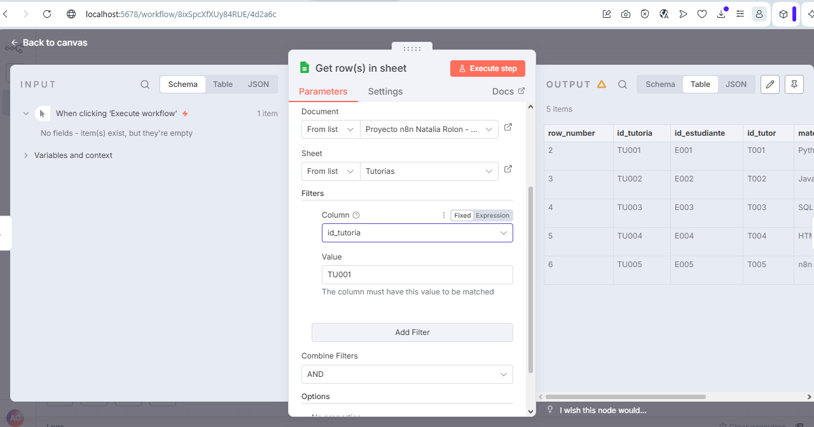

# 📚 TutorBot -- Sistema Automatizado de Gestión de Tutorías Académicas

Sistema desarrollado en **n8n** para automatizar la gestión de tutorías
académicas mediante la integración de **Discord**, **Google Sheets** y
un motor inteligente de asignación.

## 👥 Integrantes

-   Natalia Rolón
-   Alejandro Camacho

## 📖 Introducción

En el entorno educativo actual, la coordinación de asesorías académicas
suele realizarse mediante procesos manuales, generando retrasos, cruces
de horario y poca trazabilidad.

**TutorBot** automatiza este proceso utilizando **n8n** como motor de
automatización, **Discord** como interfaz conversacional y **Google
Sheets** como base de datos. El sistema administra el ciclo completo de
una tutoría, desde la solicitud hasta su finalización.

## 🎯 Objetivos

-   Desarrollar un sistema automatizado que integre Discord, Google
    Sheets y n8n.
-   Asignar automáticamente tutores según materia y disponibilidad.
-   Gestionar el estado de las tutorías.
-   Evitar cruces de horarios.
-   Mantener un historial centralizado de la información.

## 🛠 Tecnologías utilizadas

  Tecnología      Uso

--------------- ----------------------

  n8n             Automatización
  Google Sheets   Base de datos
  Google Cloud    OAuth
  Discord         Interfaz del usuario
  JavaScript      Expresiones en n8n
  

## ⚙ Descripción del sistema

### Interfaz en Discord

-   Registro de estudiantes.
-   Solicitud de tutorías.
-   Consulta del estado.
-   Cancelación de tutorías.

### Motor de Automatización (n8n)

-   Gestión de sesiones.
-   Lógica de asignación.
-   Validación de disponibilidad.
-   Registro y actualización de tutorías.
-   Notificaciones.

## 🗄 Modelo de datos

### TUTORES

`id_tutor, nombre, especialidad_materias, estado`

### DISPONIBILIDAD

`id_dispo, id_tutor, dia_semana, hora_inicio, hora_fin, estado`

### TUTORIAS

`id_tutoria, id_estudiante, id_tutor, materia, fecha, hora, estado`

### SESSIONS

`discord_user, pantalla_actual, paso_actual, datos_parciales`

## 🔄 Flujo "Solicitar Tutoría"

1.  Selección de materia.
2.  Ingreso de fecha.
3.  Búsqueda automática.
4.  Confirmación.
5.  Registro como **Asignada**.

## 📁 Estructura del proyecto

``` text
Proyecto_TutorBot_RolonNatalia_CamachoAlejandro/
├── evidencias/
├── workflows/
│   ├── Cancelar_Tutoria.json
│   ├── Consultar_Tutoria.json
│   ├── Motor_Asignacion.json
│   ├── Registro_Estudiante.json
│   └── Reportes.json
└── README.md
```

## 🚀 Instalación

1.  Clonar el repositorio.
2.  Ejecutar n8n.
3.  Importar los archivos `.json` de `workflows/`.
4.  Configurar Google Sheets OAuth2.
5.  Configurar el bot de Discord.
6.  Activar los workflows.

## 🧪 Pruebas realizadas

### Consultar Tutoría

  Caso                  Entrada   Resultado esperado      Resultado obtenido

--------------------- --------- ----------------------- --------------------

  Tutoría existente     TU001     Mostrar tutoría         ✅ Correcto
  Tutoría inexistente   TU999     Tutoría no encontrada   ✅ Correcto
  Campo vacío           Sin ID    Mensaje de error        Pendiente

### Cancelar Tutoría

  Caso                  Entrada   Resultado esperado          Resultado obtenido

--------------------- --------- --------------------------- --------------------

  Tutoría existente     TU001     Cancelada y horario libre   ✅ Correcto
  Tutoría inexistente   TU999     Error                       ✅ Correcto
  Ya cancelada          TU005     Informar estado             Pendiente

### Nota técnica

El nodo **Liberar Horario Tutor** actualmente identifica registros
utilizando únicamente `id_tutor`. Como mejora futura se recomienda
realizar el emparejamiento utilizando múltiples columnas (`id_tutor`,
`dia_semana` y `hora_inicio`) para liberar únicamente la franja
correspondiente.

## 📸 Evidencias

**Cancelar Tutoría --- caso exitoso**



**Cancelar Tutoría --- id inexistente**


**Consultar Tutoría**



## ✅ Resultado esperado

-   Reducción del tiempo de asignación.
-   Eliminación de cruces de horario.
-   Mayor trazabilidad.
-   Automatización del proceso.
-   
## 📌 Conclusiones

TutorBot demuestra cómo **n8n**, **Discord** y **Google Sheets** pueden
integrarse para automatizar la gestión de tutorías académicas,
reduciendo tiempos de respuesta y mejorando la administración de la
información mediante una arquitectura modular y escalable.

# Google Sheets
Link de la base de datos:
https://docs.google.com/spreadsheets/d/1uK9h2OehoZZ5dEnooeKckfGbdbzMEoOPdOTX8-nRvD8/edit?usp=sharing