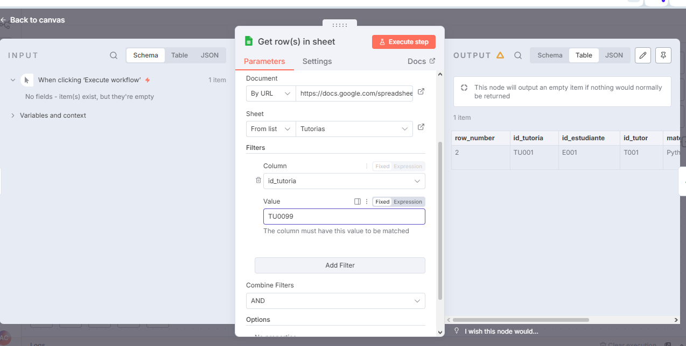
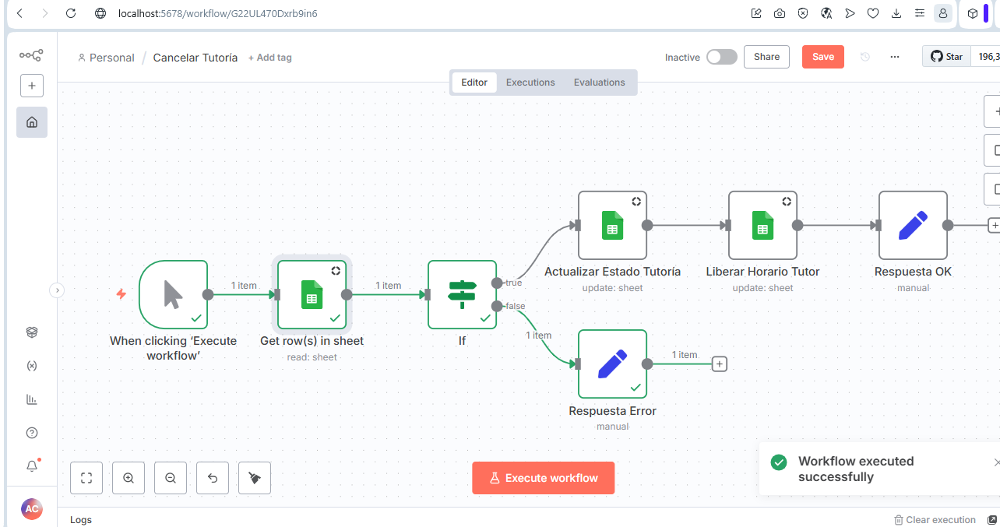

# TutorBot — Sistema Automatizado de Asignación de Tutorías

##  Integrántes

- Natlia Rolón
- Alejandro Camacho

## Introducción

En el entorno educativo actual, coordinar asesorías académicas suele ser un proceso manual y desordenado: los estudiantes dependen de correos o mensajes informales para encontrar tutor, y los tutores no cuentan con una agenda centralizada. Esto genera cruces de horario, materias sin atender y falta de trazabilidad.


**TutorBot** es una solución automatizada construida en **n8n** que conecta estudiantes con tutores mediante un motor de asignación inteligente, gestionando todo el ciclo de la asesoría: desde la solicitud inicial hasta su finalización.

## Objetivos

- Desarrollar un sistema automatizado de gestión de tutorías que integre WhatsApp, Google Sheets y lógica de asignación.
- Implementar un motor de búsqueda que asocie automáticamente materia, tutor y horario libre.
- Diseñar una interfaz conversacional para que el estudiante se autogestione (solicitar, consultar, cancelar).
- Automatizar el control de estados de la tutoría (Solicitada, Asignada, Confirmada, Finalizada, Cancelada).
- Generar reportes automáticos de actividad para la coordinación académica.
- Validar disponibilidad en tiempo real para evitar cruces de agenda o doble reserva.
- 

## Descripción del sistema

### Interfaz en WhatsApp
Punto de contacto único donde el estudiante puede:
- Registrarse como estudiante.
- Seleccionar materias mediante menús numéricos.
- Consultar el estado de sus solicitudes.
- Cancelar una tutoría.

### Motor de automatización (n8n)
- **Gestión de sesiones:** mantiene el estado del usuario para guiarlo en flujos de varios pasos (wizard), usando la hoja `SESSIONS`.
- **Lógica de asignación:** busca tutores que coincidan con la materia solicitada y tengan horario libre.
- **Notificaciones:** envía mensajes de confirmación al estudiante (y al tutor, según el flujo) cuando hay un emparejamiento o cambio de estado.

### Modelo de datos (Google Sheets — `TutorBot_DB`)

**Hoja TUTORES**
`id_tutor, nombre, especialidad_materias, estado (Activo/Inactivo)`

**Hoja DISPONIBILIDAD**
`id_dispo, id_tutor, dia_semana, hora_inicio, hora_fin, estado (Libre/Ocupado)`

**Hoja TUTORIAS**
`id_tutoria, id_estudiante, id_tutor, materia, fecha, hora, estado`

**Hoja SESSIONS**
`WhatShapp_user, pantalla_actual, paso_actual, datos_parciales`

### Flujo guiado — "Solicitar Tutoría"
1. **Materia:** el bot muestra las materias disponibles.
2. **Fecha:** el usuario ingresa la fecha.
3. **Búsqueda:** el sistema busca tutores disponibles.
4. **Confirmación:** el usuario confirma tutor y horario.
5. **Notificación:** la tutoría queda "Asignada" y se avisa al tutor.

## Resultado esperado

- Reducción significativa en el tiempo de asignación de tutorías frente al proceso manual.
- Trazabilidad total: historial completo de quién solicitó, quién atendió y cuándo terminó.
- Escalabilidad para gestionar múltiples tutores y estudiantes simultáneamente.
- Experiencia de usuario amigable, guiada paso a paso, sin necesidad de manuales.

## Estructura del proyecto

```
Proyecto_TutorBot_RolonNatalia_CamachoAlejandro/
├── evidencias/
├── workflows/
│   ├── Cancelar_Tutoria.json
│   ├── Consultar_Tutoria.json
│   ├── Motor_Asignacion.json
│   ├── Registro_Estudiante.json
│   └── Reportes.json
└── README.md
```

## Instrucciones de instalación y uso

1. Clonar este repositorio.
2. Tener una instancia de **n8n** corriendo (local o cloud).
3. Importar cada archivo `.json` de la carpeta `workflows/` en n8n (menú *Import from File*).
4. Configurar las credenciales:
   - **Google Sheets OAuth2** apuntando al documento `TutorBot_DB`.
   - **Twilio** con el número de WhatsApp Sandbox del proyecto.
5. Activar los workflows y probar enviando un mensaje al número de WhatsApp Sandbox configurado.

## Pruebas realizadas

**Estado:** Casos de "Consultar Tutoría" y "Cancelar Tutoría"

### Consultar Tutoría

| # | Caso | Entrada | Resultado esperado | Resultado obtenido |
|---|------|---------|---------------------|---------------------|
| 8 | Consulta con id válido | `id_tutoria = TU001` (existente en la hoja TUTORIAS) | Se muestra "Tutoría encontrada correctamente" | ✅ Correcto — mostró "Tutoría encontrada correctamente." |
| 9 | Consulta con id inexistente | `id_tutoria = TU999` (no existe) | Se muestra "Tutoría no encontrada." | ✅ Correcto — mostró "Tutoría no encontrada." |
| 10 | Consulta con campo vacío | El usuario no envía ningún `id_tutoria` | El sistema cae en la rama False (no encontrada) sin generar error | Pendiente (opcional) |

### Cancelar Tutoría

| # | Caso | Entrada | Resultado esperado | Resultado obtenido |
|---|------|---------|---------------------|---------------------|
| 11 | Cancelación exitosa | `id_tutoria` válido | El estado de la tutoría cambia a "Cancelada" y la franja correspondiente en DISPONIBILIDAD vuelve a "libre" | ✅ Correcto — estado cambió a "Cancelada" y disponibilidad quedó en "libre" |
| 12 | Cancelación con id inexistente | `id_tutoria = TU0099` (no existe) | Se muestra "Tutoría no encontrada.", no se modifica ninguna hoja | ✅ Correcto — cayó en rama False, mostró "Respuesta Error" sin tocar ninguna hoja |
| 13 | Cancelación de tutoría ya cancelada | `id_tutoria` de una tutoría cuyo estado ya es "Cancelada" | (Definir con Natalia) — idealmente el sistema informa que ya estaba cancelada | Pendiente (opcional) |

#### Nota técnica (limitación conocida)
El nodo "Liberar Horario Tutor" solo puede matchear la fila de Disponibilidad por `id_tutor` (n8n no permitió seleccionar más de una columna en esta versión). Si un tutor tiene varias franjas horarias, esto libera todas sus franjas en vez de solo la específica que se canceló. Mejora futura: usar mapeo con múltiples columnas de match (`id_tutor` + `dia_semana` + `hora_inicio`).

## Evidencia (capturas de ejecución real)

**Cancelar Tutoría — caso exitoso (#11):** ejecución completa, rama True, todos los nodos con check verde hasta "Respuesta OK".


**Cancelar Tutoría — id inexistente (#12):** filtro con `TU0099` (no existe) y ejecución cayendo correctamente en rama False → "Respuesta Error".




**Consultar Tutoría — filtro configurado (#8):** nodo "Get row(s) in sheet" filtrando por `id_tutoria = TU001`.


